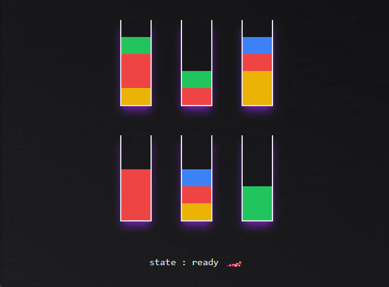

# Jozzo

> A color sort puZZle that has nothing to do with &lt;3 JoJo's Bizarre Adventure &lt;3

## Demo

[Try it online](https://jozzo.netlify.app)

[Hosting graciously provided by Netlify](https://www.netlify.app)

## Todo

- [ ] try other state machines
- [ ] game generator that start with full bottle and mix them
- [ ] use css animations and/or js animations and/or a lib for the pouring animation
- [ ] add Jojo theme/references
- [ ] add a Konami code ^^
- [ ] add a fail/success screen
- [ ] handle a difficulty level :
  - [ ] hard : 1 empty bottle, 10 stages and 8 colors
  - [ ] medium : 2 empty bottles, 6 stages and 6 colors
  - [ ] easy : 2 empty bottle, 4 stages and 3 colors

## Thanks

- [Eslint](https://eslint.org) : super tool to find & fix problems
- [Github](https://github.com) : for all their great work year after year, pushing OSS forward
- [Netlify](https://netlify.com) : awesome company that offers free CI & hosting for OSS projects
- [Paint bucket icon](https://uxwing.com/paint-bucket-icon/) : for the bucket icon
- [Repo-checker](https://github.com/Shuunen/repo-checker) : eslint cover /src code and this tool the rest ^^
- [Shields.io](https://shields.io) : for the nice badges on top of this readme
- [Shuutils](https://github.com/Shuunen/shuutils) : collection of pure JS utils
- [TailwindCss](https://tailwindcss.com) : awesome lib to produce maintainable style
- [V8](https://github.com/demurgos/v8-coverage) : simple & effective cli for code coverage
- [Vite](https://github.com/vitejs/vite) : super fast frontend tooling
- [Vitest](https://github.com/vitest-dev/vitest) : super fast vite-native testing framework

## Stargazers over time

## Page views

